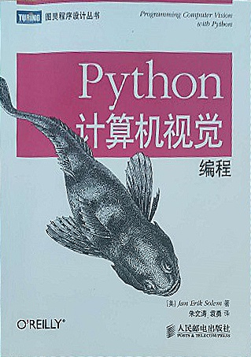

# wrap_paper
 书本或纸张照片的矫正
## 代码功能介绍
* 读取原图im1，获取轮廓im2 
* 筛选出最大轮廓 
* 根据轮廓，来生成近似轮廓（四边形） 
* 如果近似轮廓的表述结构为四个点（即四边形的四个顶点），则计算最长的边长；否则图片不合格，退出程序 
* 组装透视变换的四个参考点 
* 组装透视变换的四个待变换的点,由于检测到的四个点的顺序可能是混乱的，需要整理它们的顺序，使之分别与四个参考点对应 
* 获取透视变换矩阵M，并根据M讲原图im1进行变换 
* 锐化 

## 开发环境
`python` 
`opencv` 
`numpy`
 
## 执行效果
#### 原图

#### 提取轮廓

#### 扭曲（wrap）后的效果图

#### 把上一步结果，进行锐化后的效果图

